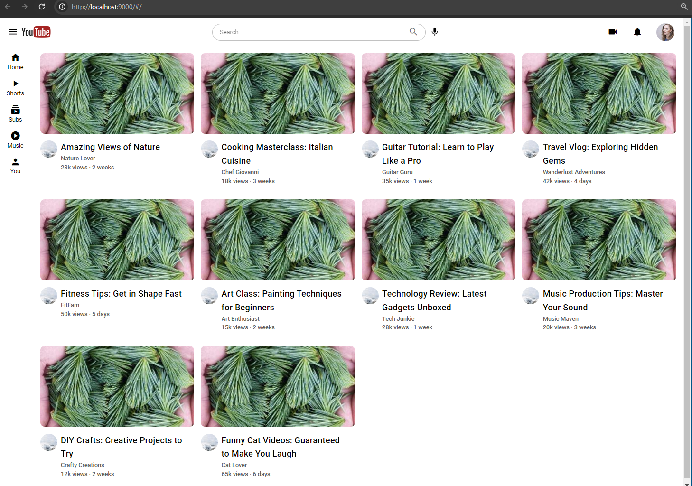

# Project Description: YouTube Clone

The project, which is a YouTube clone, has 3 possible states:

1. **Desktop Access:**

   - Full view of the videos.
     

2. **Responsive Design:**

   - If the screen is reduced, it will be responsive.
     

3. **Mobile Access:**
   - If accessed from a mobile device, it has another type of behavior similar to that of YouTube.
     

## Install the dependencies

```bash
yarn
# or
npm install
```

### Start the app in development mode (hot-code reloading, error reporting, etc.)

```bash
quasar dev
```

### Lint the files

```bash
yarn lint
# or
npm run lint
```

### Format the files

```bash
yarn format
# or
npm run format
```

### Build the app for production

```bash
quasar build
```

### Customize the configuration

See [Configuring quasar.config.js](https://v2.quasar.dev/quasar-cli-vite/quasar-config-js).
